# Glue Workflow Orchestration: `restaurant_daily_pipeline_workflow`

This document summarizes the AWS Glue Workflow used to orchestrate the restaurant analytics pipeline.

## Pipeline overview

The workflow orchestrates movement through the following layers:

```text
SQL Server → S3 raw → S3 silver → S3 gold → S3 marts
```

## Workflow diagram

```mermaid
flowchart LR
    wnode_a7a1adb1fc3b50b298f54cba3d9289652c0a6b6b970193d243ba271ea945b536{"restaurant_after_ingest_date_dim_trigger"}
    wnode_e171e1dd5139e896a216bf147d0e84a215988c6e713334c14536e7300ed6c5dd{"restaurant_after_ingest_order_item_options_trigger"}
    wnode_c599a9a6100df9cbac8bbf45a14b01e6f3445801f2b178b7cd3d0aebb4938c08{"restaurant_after_ingest_order_items_trigger"}
    wnode_7360fc0bd36b095d1ab19ef9ebd5cf557fc11dc36c5f78aef83b7634aa6b105a{"restaurant_after_silver_order_items_and_options_trigger"}
    wnode_7e1241a41fdc24bdafdbe6e8ac84d19c1a2b66de5e2f96e5f31c90f21e4661f8{"restaurant_after_gold_fact_order_line_trigger"}
    wnode_f654d68d138e9c871e259e74b8f6883d386a7fec102bab3889a904477e9cc542{"restaurant_after_gold_fact_order_trigger"}
    wnode_c1bf48a2390e2fb27b7a025b26ec38f66a84fc613fde88fd5418fe646ed77416{"restaurant_after_customer_daily_clv_trigger"}
    wnode_941744e40992ced1fef04e33cbb36005b1137b41e8e3c171e104551c82839477{"restaurant_after_customer_clv_snapshot_trigger"}
    wnode_0d2617af60a62dde02f4c86f70c0a91660dfb9b9f8a842ebc5b7491de555c7c8{"restaurant_after_gold_fact_order_and_date_dim_trigger"}
    wnode_557708a162caf2aeba57ae9f0f6fa8e1e6515e335652ba4837c0bd110b96f1e4{"restaurant_after_silver_order_item_options_mart_trigger"}
    wnode_85a0aae9236c89fda96d16c4a659fd50473fd587afa8f40d3708265ac6118561{"restaurant_after_all_marts_crawler_trigger"}
    wnode_6e3ab363f91e45dd24fc550fd0fb893433af6f0012db333c8ec253f5a2926c02{"restaurant_daily_pipeline_schedule_trigger"}
    wnode_ca0a34bfe53b09b65ef488356120994fb860f6f58e6b7cbbe2f5b246595b5f58["restaurant_mart_daily_sales"]
    wnode_2546798e090cc8d676ffe9ee74268bf891af514d34b6810d514eee9bd1b7cd19["restaurant_ingest_order_items_to_raw"]
    wnode_4aad1105352ee01c27478627e1287257bf9b215a978248a1f18595d5cac01fd9["restaurant_mart_restaurant_daily_sales"]
    wnode_47ff27eb163e1b9259760aa3570d37beb7e80a5cd2b5e41a49e206fcf002d5cd["restaurant_ingest_date_dim_to_raw"]
    wnode_4ca232507967af6eb41d2ccdfbb0b2c6bb7eddcbbb10618d407bb18f79605f70["restaurant_silver_order_items_clean"]
    wnode_4648cf2b51b40bd03d6a734eaa8dc0f9ec49bd1806a1f8d2a21f7fffc0ec626d[/"restaurant-marts-crawler"/]
    wnode_d6c92912206a52163512d742ee94e5abc5a59e3e42ddca6bfded08adfe1f12d3["restaurant_mart_customer_rfm"]
    wnode_72487bac9ed1a401f01cf9d0d8b23adda921db121aaa0c9d517c47c7f815b24f["restaurant_gold_fact_order"]
    wnode_82a38b3ad1fc01dfd355b3672e4b1c32c1bd3a8a1ab55c71e5b9dd6ca1fec891["restaurant_mart_restaurant_item_sales"]
    wnode_f15b4b28a088b78246823b5293d50f68d0543d49b74cdaf37abc82efc2325a95["restaurant_silver_order_item_options_clean"]
    wnode_457848afcd0218479179a96dd6a7370af6727152116f6cc5169ffb42ebd0e774["restaurant_gold_fact_order_line"]
    wnode_a42abaff113bf522571bee596e33c3a75eb40031c27cbe182342350338df0a75["restaurant_mart_customer_clv_snapshot"]
    wnode_5ac11c820544c5c3bb2c121e5d7b41a065b0e863eb59df35616b97171f98b15b["restaurant_ingest_order_item_options_to_raw"]
    wnode_9687c48563c5fee6c6bdc31dbc5496b0462f7e6df514721db6349f22e681163c["restaurant_mart_customer_daily_clv"]
    wnode_0c9c8eb0584ab030d529092fd28ea1fde93f03c26700a436665ab55bab707faa["restaurant_silver_date_dim_clean"]
    wnode_54ba1c4e5ef4c8ec572f4e13186071d0c37c3128edfe7ef2fa7cbc01a711ceb5["restaurant_mart_option_sales"]
    wnode_8ded7357d90a7f33c82871ac04e45f8ffa8830e3dbe7ec27143c9daea70bf975["restaurant_mart_item_sales"]

    wnode_0d2617af60a62dde02f4c86f70c0a91660dfb9b9f8a842ebc5b7491de555c7c8 --> wnode_ca0a34bfe53b09b65ef488356120994fb860f6f58e6b7cbbe2f5b246595b5f58
    wnode_6e3ab363f91e45dd24fc550fd0fb893433af6f0012db333c8ec253f5a2926c02 --> wnode_2546798e090cc8d676ffe9ee74268bf891af514d34b6810d514eee9bd1b7cd19
    wnode_0d2617af60a62dde02f4c86f70c0a91660dfb9b9f8a842ebc5b7491de555c7c8 --> wnode_4aad1105352ee01c27478627e1287257bf9b215a978248a1f18595d5cac01fd9
    wnode_6e3ab363f91e45dd24fc550fd0fb893433af6f0012db333c8ec253f5a2926c02 --> wnode_47ff27eb163e1b9259760aa3570d37beb7e80a5cd2b5e41a49e206fcf002d5cd
    wnode_c599a9a6100df9cbac8bbf45a14b01e6f3445801f2b178b7cd3d0aebb4938c08 --> wnode_4ca232507967af6eb41d2ccdfbb0b2c6bb7eddcbbb10618d407bb18f79605f70
    wnode_85a0aae9236c89fda96d16c4a659fd50473fd587afa8f40d3708265ac6118561 --> wnode_4648cf2b51b40bd03d6a734eaa8dc0f9ec49bd1806a1f8d2a21f7fffc0ec626d
    wnode_941744e40992ced1fef04e33cbb36005b1137b41e8e3c171e104551c82839477 --> wnode_d6c92912206a52163512d742ee94e5abc5a59e3e42ddca6bfded08adfe1f12d3
    wnode_7e1241a41fdc24bdafdbe6e8ac84d19c1a2b66de5e2f96e5f31c90f21e4661f8 --> wnode_72487bac9ed1a401f01cf9d0d8b23adda921db121aaa0c9d517c47c7f815b24f
    wnode_7e1241a41fdc24bdafdbe6e8ac84d19c1a2b66de5e2f96e5f31c90f21e4661f8 --> wnode_82a38b3ad1fc01dfd355b3672e4b1c32c1bd3a8a1ab55c71e5b9dd6ca1fec891
    wnode_e171e1dd5139e896a216bf147d0e84a215988c6e713334c14536e7300ed6c5dd --> wnode_f15b4b28a088b78246823b5293d50f68d0543d49b74cdaf37abc82efc2325a95
    wnode_7360fc0bd36b095d1ab19ef9ebd5cf557fc11dc36c5f78aef83b7634aa6b105a --> wnode_457848afcd0218479179a96dd6a7370af6727152116f6cc5169ffb42ebd0e774
    wnode_c1bf48a2390e2fb27b7a025b26ec38f66a84fc613fde88fd5418fe646ed77416 --> wnode_a42abaff113bf522571bee596e33c3a75eb40031c27cbe182342350338df0a75
    wnode_6e3ab363f91e45dd24fc550fd0fb893433af6f0012db333c8ec253f5a2926c02 --> wnode_5ac11c820544c5c3bb2c121e5d7b41a065b0e863eb59df35616b97171f98b15b
    wnode_f654d68d138e9c871e259e74b8f6883d386a7fec102bab3889a904477e9cc542 --> wnode_9687c48563c5fee6c6bdc31dbc5496b0462f7e6df514721db6349f22e681163c
    wnode_a7a1adb1fc3b50b298f54cba3d9289652c0a6b6b970193d243ba271ea945b536 --> wnode_0c9c8eb0584ab030d529092fd28ea1fde93f03c26700a436665ab55bab707faa
    wnode_557708a162caf2aeba57ae9f0f6fa8e1e6515e335652ba4837c0bd110b96f1e4 --> wnode_54ba1c4e5ef4c8ec572f4e13186071d0c37c3128edfe7ef2fa7cbc01a711ceb5
    wnode_7e1241a41fdc24bdafdbe6e8ac84d19c1a2b66de5e2f96e5f31c90f21e4661f8 --> wnode_8ded7357d90a7f33c82871ac04e45f8ffa8830e3dbe7ec27143c9daea70bf975
    wnode_47ff27eb163e1b9259760aa3570d37beb7e80a5cd2b5e41a49e206fcf002d5cd --> wnode_a7a1adb1fc3b50b298f54cba3d9289652c0a6b6b970193d243ba271ea945b536
    wnode_5ac11c820544c5c3bb2c121e5d7b41a065b0e863eb59df35616b97171f98b15b --> wnode_e171e1dd5139e896a216bf147d0e84a215988c6e713334c14536e7300ed6c5dd
    wnode_2546798e090cc8d676ffe9ee74268bf891af514d34b6810d514eee9bd1b7cd19 --> wnode_c599a9a6100df9cbac8bbf45a14b01e6f3445801f2b178b7cd3d0aebb4938c08
    wnode_a42abaff113bf522571bee596e33c3a75eb40031c27cbe182342350338df0a75 --> wnode_941744e40992ced1fef04e33cbb36005b1137b41e8e3c171e104551c82839477
    wnode_457848afcd0218479179a96dd6a7370af6727152116f6cc5169ffb42ebd0e774 --> wnode_7e1241a41fdc24bdafdbe6e8ac84d19c1a2b66de5e2f96e5f31c90f21e4661f8
    wnode_d6c92912206a52163512d742ee94e5abc5a59e3e42ddca6bfded08adfe1f12d3 --> wnode_85a0aae9236c89fda96d16c4a659fd50473fd587afa8f40d3708265ac6118561
    wnode_ca0a34bfe53b09b65ef488356120994fb860f6f58e6b7cbbe2f5b246595b5f58 --> wnode_85a0aae9236c89fda96d16c4a659fd50473fd587afa8f40d3708265ac6118561
    wnode_4aad1105352ee01c27478627e1287257bf9b215a978248a1f18595d5cac01fd9 --> wnode_85a0aae9236c89fda96d16c4a659fd50473fd587afa8f40d3708265ac6118561
    wnode_8ded7357d90a7f33c82871ac04e45f8ffa8830e3dbe7ec27143c9daea70bf975 --> wnode_85a0aae9236c89fda96d16c4a659fd50473fd587afa8f40d3708265ac6118561
    wnode_54ba1c4e5ef4c8ec572f4e13186071d0c37c3128edfe7ef2fa7cbc01a711ceb5 --> wnode_85a0aae9236c89fda96d16c4a659fd50473fd587afa8f40d3708265ac6118561
    wnode_82a38b3ad1fc01dfd355b3672e4b1c32c1bd3a8a1ab55c71e5b9dd6ca1fec891 --> wnode_85a0aae9236c89fda96d16c4a659fd50473fd587afa8f40d3708265ac6118561
    wnode_f15b4b28a088b78246823b5293d50f68d0543d49b74cdaf37abc82efc2325a95 --> wnode_557708a162caf2aeba57ae9f0f6fa8e1e6515e335652ba4837c0bd110b96f1e4
    wnode_4ca232507967af6eb41d2ccdfbb0b2c6bb7eddcbbb10618d407bb18f79605f70 --> wnode_7360fc0bd36b095d1ab19ef9ebd5cf557fc11dc36c5f78aef83b7634aa6b105a
    wnode_f15b4b28a088b78246823b5293d50f68d0543d49b74cdaf37abc82efc2325a95 --> wnode_7360fc0bd36b095d1ab19ef9ebd5cf557fc11dc36c5f78aef83b7634aa6b105a
    wnode_9687c48563c5fee6c6bdc31dbc5496b0462f7e6df514721db6349f22e681163c --> wnode_c1bf48a2390e2fb27b7a025b26ec38f66a84fc613fde88fd5418fe646ed77416
    wnode_72487bac9ed1a401f01cf9d0d8b23adda921db121aaa0c9d517c47c7f815b24f --> wnode_f654d68d138e9c871e259e74b8f6883d386a7fec102bab3889a904477e9cc542
    wnode_72487bac9ed1a401f01cf9d0d8b23adda921db121aaa0c9d517c47c7f815b24f --> wnode_0d2617af60a62dde02f4c86f70c0a91660dfb9b9f8a842ebc5b7491de555c7c8
    wnode_0c9c8eb0584ab030d529092fd28ea1fde93f03c26700a436665ab55bab707faa --> wnode_0d2617af60a62dde02f4c86f70c0a91660dfb9b9f8a842ebc5b7491de555c7c8
```



## Trigger dependency table

| Trigger | Logic | Watches | Starts |
|---|---|---|---|
| `restaurant_after_all_marts_crawler_trigger` | `AND` | `restaurant_mart_customer_rfm` `SUCCEEDED`<br>`restaurant_mart_daily_sales` `SUCCEEDED`<br>`restaurant_mart_restaurant_daily_sales` `SUCCEEDED`<br>`restaurant_mart_item_sales` `SUCCEEDED`<br>`restaurant_mart_option_sales` `SUCCEEDED`<br>`restaurant_mart_restaurant_item_sales` `SUCCEEDED` | `restaurant-marts-crawler` |
| `restaurant_after_customer_clv_snapshot_trigger` | `ANY` | `restaurant_mart_customer_clv_snapshot` `SUCCEEDED` | `restaurant_mart_customer_rfm` |
| `restaurant_after_customer_daily_clv_trigger` | `ANY` | `restaurant_mart_customer_daily_clv` `SUCCEEDED` | `restaurant_mart_customer_clv_snapshot` |
| `restaurant_after_gold_fact_order_and_date_dim_trigger` | `AND` | `restaurant_gold_fact_order` `SUCCEEDED`<br>`restaurant_silver_date_dim_clean` `SUCCEEDED` | `restaurant_mart_daily_sales`<br>`restaurant_mart_restaurant_daily_sales` |
| `restaurant_after_gold_fact_order_line_trigger` | `ANY` | `restaurant_gold_fact_order_line` `SUCCEEDED` | `restaurant_gold_fact_order`<br>`restaurant_mart_item_sales`<br>`restaurant_mart_restaurant_item_sales` |
| `restaurant_after_gold_fact_order_trigger` | `ANY` | `restaurant_gold_fact_order` `SUCCEEDED` | `restaurant_mart_customer_daily_clv` |
| `restaurant_after_ingest_date_dim_trigger` | `ANY` | `restaurant_ingest_date_dim_to_raw` `SUCCEEDED` | `restaurant_silver_date_dim_clean` |
| `restaurant_after_ingest_order_item_options_trigger` | `ANY` | `restaurant_ingest_order_item_options_to_raw` `SUCCEEDED` | `restaurant_silver_order_item_options_clean` |
| `restaurant_after_ingest_order_items_trigger` | `ANY` | `restaurant_ingest_order_items_to_raw` `SUCCEEDED` | `restaurant_silver_order_items_clean` |
| `restaurant_after_silver_order_item_options_mart_trigger` | `ANY` | `restaurant_silver_order_item_options_clean` `SUCCEEDED` | `restaurant_mart_option_sales` |
| `restaurant_after_silver_order_items_and_options_trigger` | `AND` | `restaurant_silver_order_items_clean` `SUCCEEDED`<br>`restaurant_silver_order_item_options_clean` `SUCCEEDED` | `restaurant_gold_fact_order_line` |
| `restaurant_daily_pipeline_schedule_trigger` | `-` | - | `restaurant_ingest_date_dim_to_raw`<br>`restaurant_ingest_order_item_options_to_raw`<br>`restaurant_ingest_order_items_to_raw` |

## Notes

- The exported Glue workflow JSON is stored at `docs/glue_workflow_restaurant_daily_pipeline.json`.
- The Mermaid diagram and trigger table are generated from the exported workflow graph.
- AWS Glue's console graph is useful for a high-level visual, but the JSON export is the source of truth for documentation.
